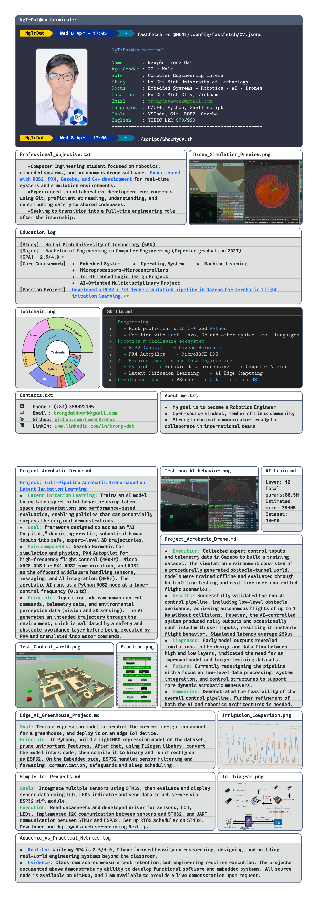

# Nguyễn Trọng Đạt - Curriculum Vitae

Computer Engineering student with a strong focus on AI and Robotics

### Core Stack
* **Languages:** C++, Python, Shell script
* **Robotics & Simulation:** ROS2, Gazebo, PX4 Autopilot
* **AI & Data:** Latent Diffusion Models
* **Tools:** Linux, Git, VS Code

---

*Click the image above to view or download the full PDF.*