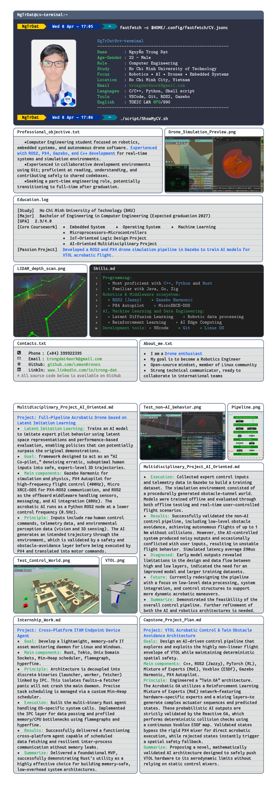

# Nguyễn Trọng Đạt - Curriculum Vitae

Computer Engineering student with a strong focus on AI and Robotics

### Core Stack
* **Languages:** C++, Python, Rust, Shell script
* **Robotics & Simulation:** ROS2, Gazebo, PX4 Autopilot
* **AI & Data:** Latent Diffusion Models, Reinforcement Learning
* **Tools:** Linux, Git, VS Code

---
*Click the image below to view or download the full PDF.*

